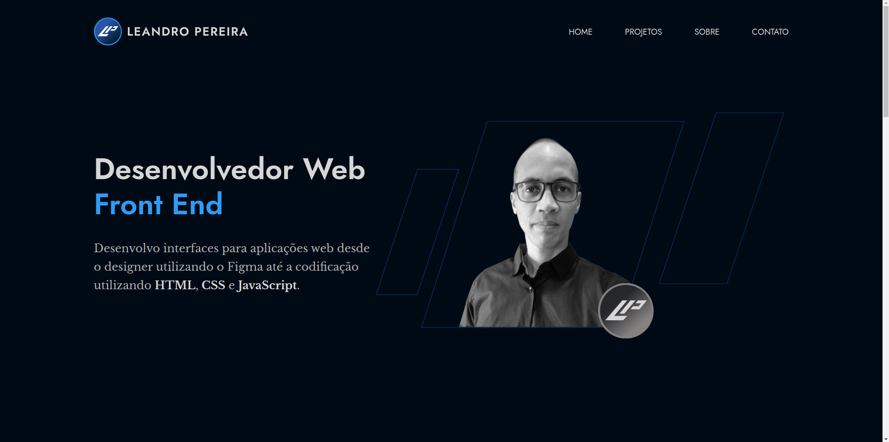

# Portfólio Pessoal
Este é o repositório do meu site de portfólio pessoal, onde compartilho informações sobre mim, meus projetos e habilidades. O site foi desenvolvido utilizando HTML, CSS e JavaScript.

## Visão Geral

Este projeto tem como objetivo apresentar meu trabalho, experiência e habilidades de forma clara e atrativa. O site contém as seguintes seções principais:

- **Home:** Uma introdução sobre mim e uma breve visão geral do conteúdo do site.
- **Projetos:** Uma seleção de projetos nos quais trabalhei, com descrições e links para mais informações.
- **Sobre Mim:** Detalhes sobre minha formação, habilidades e descrição pessoal.
- **Contato:** Informações para contato e redes sociais.

## Como Usar

Clone este repositório em sua máquina, depois abra o arquivo `index.html` no seu navegador para visualizar localmente.

```bash
git clone https://github.com/leandropereira-dev/personal-portfolio.git
